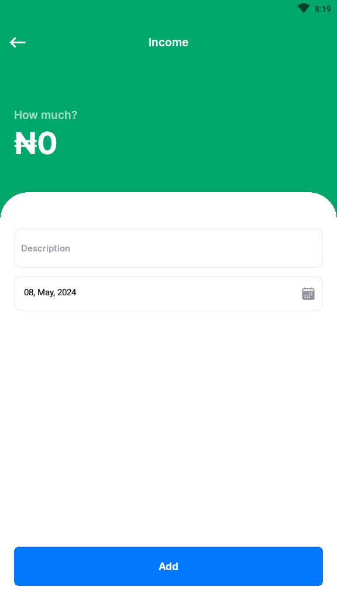
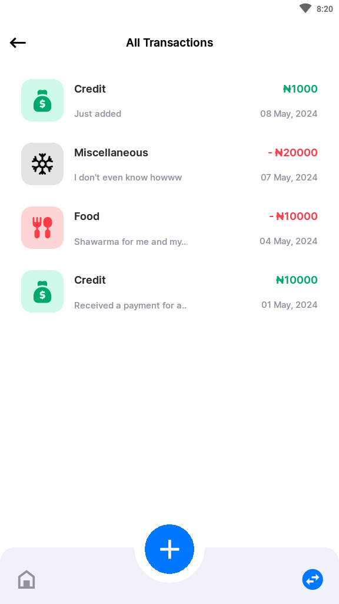

# React Native Expense Tracker

This is an expense tracker app created using react native and nodejs(express)

## Images

## Download or clone this repo

To start the app `cd` into the client directory and run `npm install` to install the necessary dependencies, also `cd` into the server directory and run `npm install` to install all neccessary dependencies for the server.
After the installation configure the enviroment variables using the .env.example files in the client and server directory.
Run `npm start` in the server directory to start the server using nodejs(express).
Run `npm start` in the client directory to start the development server using expo.
Download the expo app on your device and scan the QR code provided in the terminal to launch the app

You can also download the release in this repo to test the app in android.
